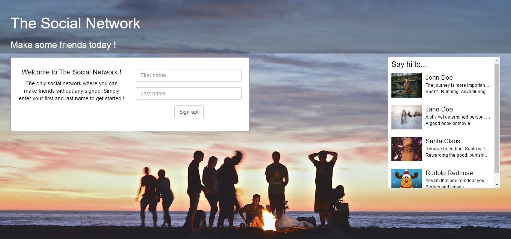

### The Social Network

This is a small project to demonstrate and practice my web application development skills. Developing features one by one on a simple social networking kind of application. The features list and status can be found below.

##### Features
* Sweet look (Done)
* Create/Edit profile (Done)
* Neo4j/h2 integration
* View friend's profile
* View friends
* Authentication and Authorization
* JUnit testing

##### Instructions to run
This is a eclipse Java project using spring, sqlite and some other dependencies.

Server code dependencies can be resolved using maven (pom.xml) and frontend depencies can be resolved by running bower install in the public/ folder.